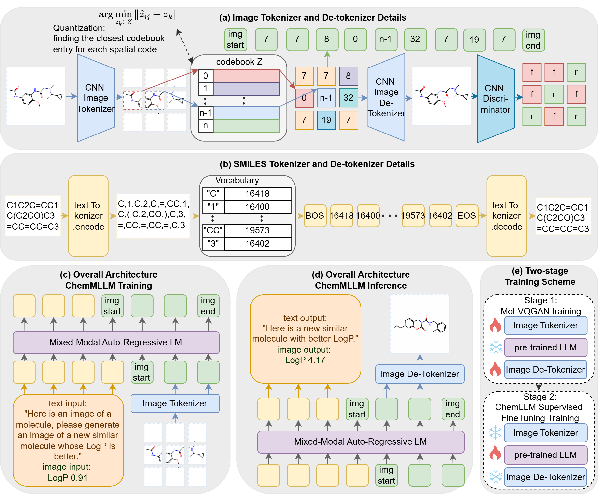

# ChemMLLM: Chemical Multimodal Large Language Model
Official Repository for ChemMLLM: Chemical Multimodal Large Language Model



## Data Generation
Due to the large size of the image data, we provide the data in text format along with a script to generate the images. 
The script requires RDKit in your Conda environment. Please install it first.
```bash
conda activate <your_env>
conda install -c conda-forge rdkit
```
Then run the following code to reconstruct the complete dataset:
```bash
cd data
python data_gen.py
```
After running the script, a new data folder will be generated with the following structure, containing training sets, test sets, and images for all 5 tasks.
```bash
data/
├── test/
│   ├── image/
│   │   ├── img2caption/
│   │   ├── img2img/
│   │   ├── img2property/
│   │   ├── img2smiles/
│   │   └── property2img/
│   ├── img2caption.json
│   ├── img2img.json
│   ├── img2property.json
│   ├── img2smiles.json
│   └── property2img.json
├── train/
│   ├── image/
│   │   ├── img2caption/
│   │   ├── img2img/
│   │   ├── img2property/
│   │   ├── img2smiles/
│   │   └── property2img/
│   ├── img2caption.json
│   ├── img2img.json
│   ├── img2property.json
│   ├── img2smiles.json
│   └── property2img.json

```

## Mol-VQGAN Training
See [vqgan/README.md](vqgan/README.md)

## Recommended Training Framework For LLM SFT

We recommend you to use [Lumina-mGPT](https://github.com/Alpha-VLLM/Lumina-mGPT) for large language model Supervised Fine-Tuning.  
Our dataset is compatible with its input pipeline and training flow.